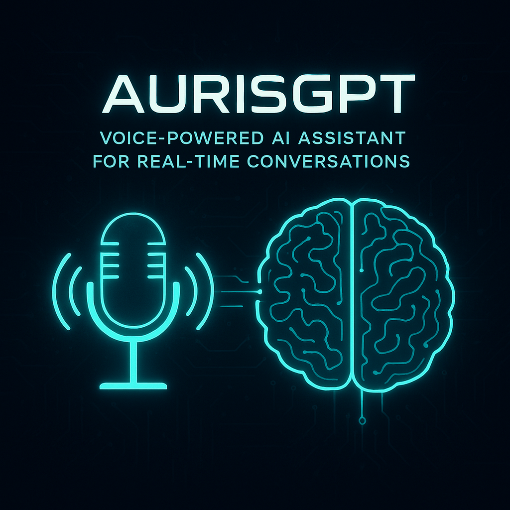
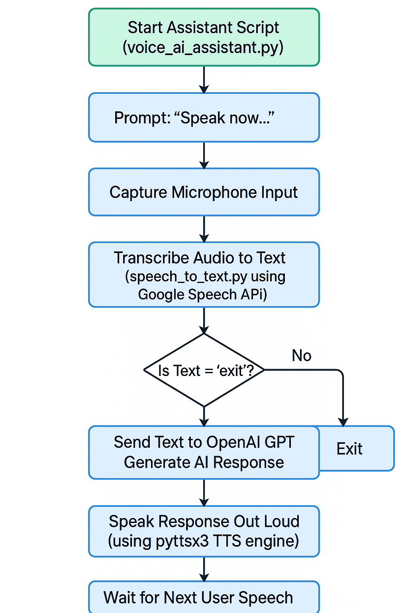
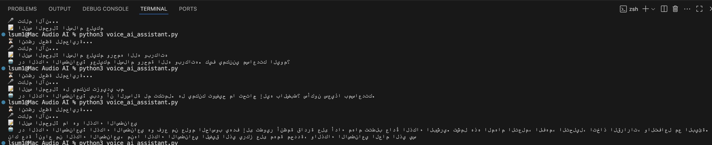

<h1 align="center">🎙️ Voice AI Assistant</h1>
<p align="center">
  <i>Natural Language Conversational Assistant with Real-Time Speech Recognition and AI Response</i>
</p>

<p align="center">
  
  
  
</p>


---

## 1. Introduction :

The **Voice AI Assistant** is a Python-powered virtual assistant that combines real-time voice recognition with OpenAI's language model to enable natural, seamless conversations. Speak into your microphone, and the assistant will understand, think, and respond — all in real time.

This solution demonstrates how voice-enabled AI can be built using open tools and APIs, bringing intelligence to the edge of human-computer interaction.



---

## 2. Features :

- **Real-Time Speech-to-Text**: Capture user speech and transcribe it using Google’s Speech Recognition API.
- **AI-Powered Understanding**: Process input and generate intelligent replies using OpenAI GPT.
- **Text-to-Speech Synthesis**: Speak back responses using the `pyttsx3` TTS engine.
- **Continuous Conversation Loop**: Maintain a fluid conversation until user exits.
- **Voice-Based Termination**: Say “exit” to end the session.

---

## 3. Project Structure :

```bash
├── voice_ai_assistant.py    # Main assistant controller
├── speech_to_text.py        # Handles audio capture and transcription
├── flowchartAI.png          # Flowchart diagram of the system
├── result.png               # Screenshot of a working session
└── README.md

```


## 4. Installation :
 
 Ensure Python 3.7+ is installed. Then, install the dependencies: 
 - pip install openai
 - pip install pyttsx3
 - pip install SpeechRecognition


##  5. Configuration :

Before running the assistant, set your OpenAI API key inside voice_ai_assistant.py:

openai.api_key = "my_key_in_API"

## 6. Usage : 
Run the assistant:

Speak naturally after the prompt:
🎤 تكلم الآن...
Say "exit" to end the session gracefully.

##  7. Example Flow : 

User: "What's artificial intelligence?"
Assistant: (Processes via GPT) → "Artificial intelligence is the simulation of human intelligence in machines..."
Assistant replies out loud.


## 8. Flowchart : 
 

Summary:

1- User speaks

2- Audio is transcribed

3- GPT processes input

4- Assistant speaks response

5- Repeats unless "exit" is said


### 9.  Project Files :

| File Name    | Language      | Description                                              | View File                    |
|--------------|---------------|----------------------------------------------------------|------------------------------|
| `Speech_to_Text.py`   | Python |  	Listens to Arabic speech and converts it to text using Google’s speech recognition.   | [View Code](speech_to_text.py) |
| `voice_ai_assistant.py` | Python        | Converts spoken Arabic to text, asks an AI model, then speaks the AI's Arabic reply aloud.  | [View Code](voice_ai_assistant.py) |


## 10. Behind the Code : 
1- speech_to_text.py 

```Text
import speech_recognition as sr

recognizer = sr.Recognizer()

with sr.Microphone() as source:
    print("⏳ انتظر لحظة لتحسين الصوت...")
    recognizer.adjust_for_ambient_noise(source, duration=1)  # تحسين الجودة
    print("🎤 تكلم الآن...")
    audio = recognizer.listen(source)

    try:
        text = recognizer.recognize_google(audio, language="ar-SA")
        print("📝 النص المحول:", text)
    except sr.UnknownValueError:
        print("❌ ما تم التعرف على الصوت.")
    except sr.RequestError as e:
        print("⚠️ مشكلة في الاتصال بخدمة Google:", e)
```
This Python code uses the `speech_recognition` library to convert spoken Arabic (Saudi Arabia) into text. It listens to the microphone after adjusting for background noise for 1 second, then sends the audio to Google’s speech recognition service. If successful, it prints the recognized text; otherwise, it handles errors for unclear speech or connection problems.

## The result : 


2-voice_ai_assistant.py 

```Text
import speech_recognition as sr
import openai
import pyttsx3

openai.api_key = "APIKey"

engine = pyttsx3.init()
recognizer = sr.Recognizer()

with sr.Microphone() as source:
    print("⏳ انتظر لحظة للمعايرة...")
    recognizer.adjust_for_ambient_noise(source, duration=1)
    print("🎤 تكلم الآن...")
    audio = recognizer.listen(source)

try:
    user_input = recognizer.recognize_google(audio, language="ar-SA")
    print("📝 النص المحول:", user_input)

    response = openai.chat.completions.create(
        model="gpt-4o-mini",
        messages=[
            {"role": "system", "content": "أنت مساعد ذكي يتحدث فقط بالعربية الفصحى وبأسلوب واضح ومختصر."},
            {"role": "user", "content": user_input}
        ],
        max_tokens=200
    )

    reply = response.choices[0].message.content.strip()
    print("🤖 رد الذكاء الاصطناعي:", reply)

    engine.say(reply)
    engine.runAndWait()

except sr.UnknownValueError:
    print("❌ ما تم التعرف على الصوت.")
except sr.RequestError as e:
    print("⚠️ مشكلة في الاتصال:", e)
```
This script captures Arabic speech from the microphone, converts it to text using Google Speech Recognition, then sends that text to OpenAI's GPT-4o-mini model for an Arabic-language AI response. The AI reply is printed and also spoken aloud using a text-to-speech engine (`pyttsx3`). It includes error handling for unrecognized speech and connection issues.

## The result : 


## Table of Contents
- [1. Introduction](#1-introduction-)
- [2. Features](#2-features-)
- [3. Project Structure](#3-project-structure-)
- [4. Installation](#4-installation)
- [5. Configuration](#5-configuration)
- [6. Usage](#6-usage)
- [7. Example Flow](#7-example-flow-)
- [8. Flowchart](#8-flowchart-)
- [9. Project Files](#9-project-files-)
- [10. Behind the Code](#10-behind-the-code-)


 
